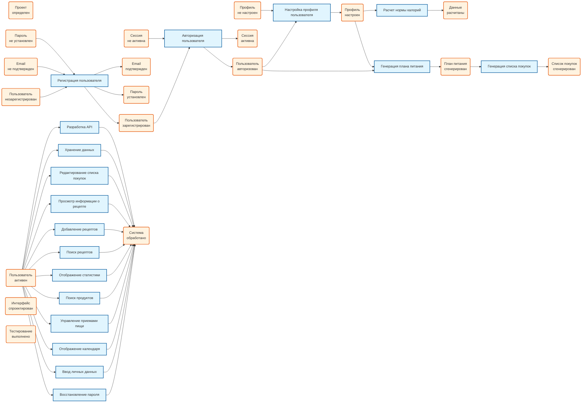

```mermaid
graph LR

  %% Стили
  classDef action fill:#e1f5fe,stroke:#01579b,stroke-width:2px
  classDef state fill:#fff3e0,stroke:#e65100,stroke-width:2px,rounded

  a00001[Регистрация пользователя]
  a00002[Авторизация пользователя]
  a00003[Восстановление пароля]
  a00004[Настройка профиля пользователя]
  a00005[Ввод личных данных]
  a00006[Расчет нормы калорий]
  a00007[Отображение календаря]
  a00008[Управление приемами пищи]
  a00009[Поиск продуктов]
  a00010[Отображение статистики]
  a00011[Генерация плана питания]
  a00012[Поиск рецептов]
  a00013[Добавление рецептов]
  a00014[Просмотр информации о рецепте]
  a00015[Генерация списка покупок]
  a00016[Редактирование списка покупок]
  a00017[Хранение данных]
  a00018[Разработка API]
  o00001s00001(Проект<br/>определен)
  o00002s00001(Пользователь<br/>незарегистрирован)
  o00002s00002(Пользователь<br/>зарегистрирован)
  o00002s00003(Пользователь<br/>авторизован)
  o00002s00004(Пользователь<br/>активен)
  o00003s00001(Email<br/>не подтвержден)
  o00003s00002(Email<br/>подтвержден)
  o00004s00001(Пароль<br/>не установлен)
  o00004s00002(Пароль<br/>установлен)
  o00005s00001(Сессия<br/>не активна)
  o00005s00002(Сессия<br/>активна)
  o00006s00001(Система<br/>обработано)
  o00007s00001(Профиль<br/>не настроен)
  o00007s00002(Профиль<br/>настроен)
  o00008s00001(Данные<br/>расчитаны)
  o00013s00001(План питания<br/>сгенерирован)
  o00016s00001(Список покупок<br/>сгенерирован)
  o00019s00001(Интерфейс<br/>спроектирован)
  o00020s00001(Тестирование<br/>выполнено)

  %% Применяем стили
  class a00001 action
  class a00002 action
  class a00003 action
  class a00004 action
  class a00005 action
  class a00006 action
  class a00007 action
  class a00008 action
  class a00009 action
  class a00010 action
  class a00011 action
  class a00012 action
  class a00013 action
  class a00014 action
  class a00015 action
  class a00016 action
  class a00017 action
  class a00018 action
  class o00001s00001 state
  class o00002s00001 state
  class o00002s00002 state
  class o00002s00003 state
  class o00002s00004 state
  class o00003s00001 state
  class o00003s00002 state
  class o00004s00001 state
  class o00004s00002 state
  class o00005s00001 state
  class o00005s00002 state
  class o00006s00001 state
  class o00007s00001 state
  class o00007s00002 state
  class o00008s00001 state
  class o00013s00001 state
  class o00016s00001 state
  class o00019s00001 state
  class o00020s00001 state

  %% Связи
  o00002s00001 --> a00001
  o00003s00001 --> a00001
  o00004s00001 --> a00001
  a00001 --> o00002s00002
  a00001 --> o00003s00002
  a00001 --> o00004s00002
  o00002s00002 --> a00002
  o00005s00001 --> a00002
  a00002 --> o00002s00003
  a00002 --> o00005s00002
  o00002s00004 --> a00003
  a00003 --> o00006s00001
  o00002s00003 --> a00004
  o00007s00001 --> a00004
  a00004 --> o00007s00002
  o00002s00004 --> a00005
  a00005 --> o00006s00001
  o00007s00002 --> a00006
  a00006 --> o00008s00001
  o00002s00004 --> a00007
  a00007 --> o00006s00001
  o00002s00004 --> a00008
  a00008 --> o00006s00001
  o00002s00004 --> a00009
  a00009 --> o00006s00001
  o00002s00004 --> a00010
  a00010 --> o00006s00001
  o00002s00003 --> a00011
  o00007s00002 --> a00011
  a00011 --> o00013s00001
  o00002s00004 --> a00012
  a00012 --> o00006s00001
  o00002s00004 --> a00013
  a00013 --> o00006s00001
  o00002s00004 --> a00014
  a00014 --> o00006s00001
  o00013s00001 --> a00015
  a00015 --> o00016s00001
  o00002s00004 --> a00016
  a00016 --> o00006s00001
  o00002s00004 --> a00017
  a00017 --> o00006s00001
  o00002s00004 --> a00018
  a00018 --> o00006s00001
```